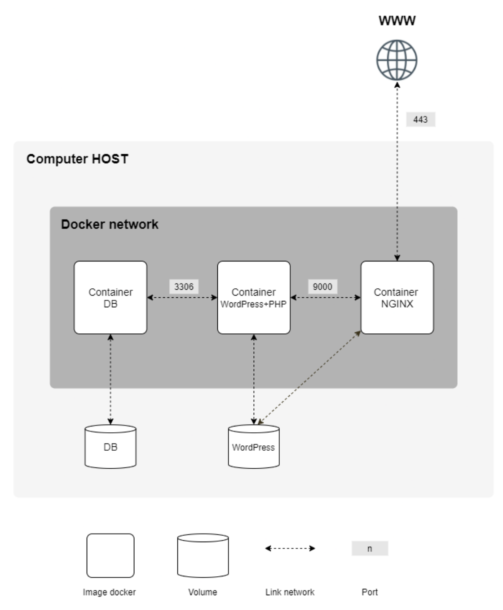

# Inception

This project aims to broaden your knowledge of system administration by using Docker. It virtualizes several Docker images, creating them in your new personal virtual machine.

## About

This project consists of setting up a small infrastructure composed of different services under specific rules. The whole project has to be done in a virtual machine using Docker Compose.



## Docker Containers

- **NGINX** with TLSv1.2 or TLSv1.3 only.
- **WordPress** + php-fpm (it must be installed and configured) only without nginx.
- **MariaDB** only without nginx.

## Prerequisites

- Docker
- Docker Compose
- Linux VM

## Usage

- Build the images and deploy the infrastructure:

    ```bash
    make
    ```

- Stop and remove containers, remove images, volumes, and network:

    ```bash
    make fclean
    ```

- Open your favourite browser and go to:
    
    ```bash
    https://localhost
    ```
    
You can see your Wordpress website.

## Detailed Description

### NGINX

The NGINX container is configured to use TLSv1.2 or TLSv1.3 only. The configuration files and scripts are located in the `srcs/requirements/nginx` directory.

- **Configuration:** `default.conf`
- **Setup Script:** `nginx_conf.sh`

### WordPress

The WordPress container uses php-fpm and is configured without nginx. The setup script installs and configures WordPress.

- **Dockerfile:** `Dockerfile`
- **Setup Script:** `wp-script.sh`

### MariaDB

The MariaDB container is configured without nginx. The setup script initializes the database.

- **Dockerfile:** `Dockerfile`
- **Setup Script:** `mariadb_script.sh`

## Makefile Commands

- `make`: Build the images and deploy the infrastructure.
- `make fclean`: Stop and remove containers, remove images, volumes, and network.
- `make host`: Add domains to the hosts file.
- `make clean`: Stop and remove containers.
- `make reload`: Rebuild and restart the containers.
- `make re`: Clean and rebuild everything.